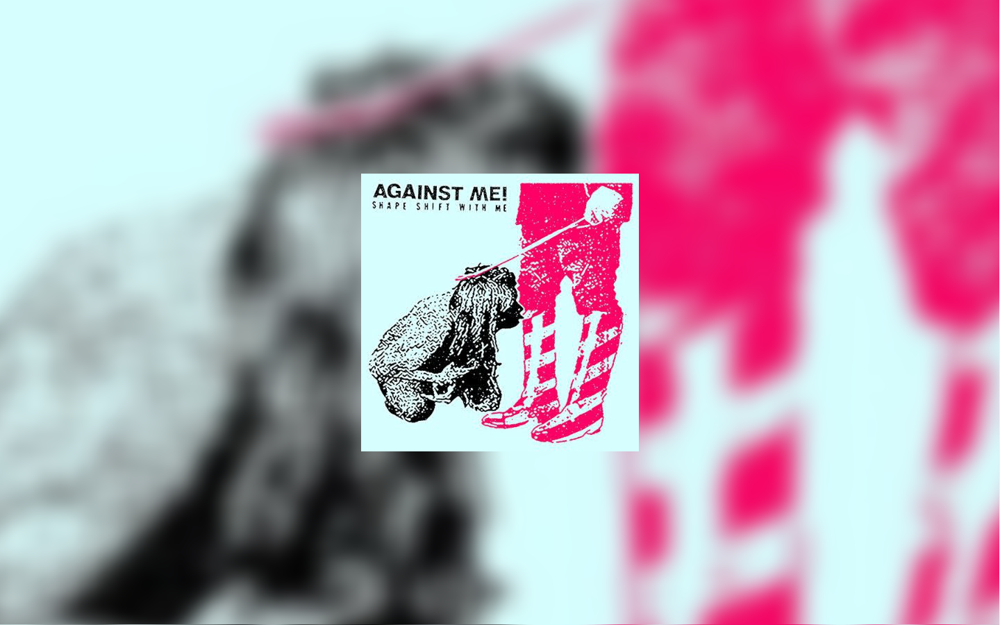

# Google Music Desktop Player Wallpapers

Generates wallpapers while listening to Google Music.

## Setup

### Download Google Play Music Desktop Player

Download and install [Google Play Music™ Desktop Player](https://github.com/MarshallOfSound/Google-Play-Music-Desktop-Player-UNOFFICIAL-).

### Enable broadcasting events from the player

To respond to events, the desktop player needs to emit them. To enable this:

1. Open the player.
2. Go to "Desktop Settings".
3. Under General, check "Enable Playback API".
4. Restart the player.

## Running

1. Download this repository.
2. Install dependencies via `npm install`.
3. Run `npm start -- --help` to see usage.

Wallpapers will be written to the current directory each time the track changes. They will have the same resolution as your main display.

You can also enable automatically setting the wallpaper of all of your visible screens.

## Wallpaper kinds

### Album Art

Generates wallpaper from the album cover art.

### Album Cover Sources

#### Google Play Music Desktop Player (Default)

Provides a thumbnail of the album cover.

#### Discogs

[Discogs](https://www.discogs.com/) provides higher quality album art images. To use it as a source, you need to create an account and [create a consumer key and secret](https://www.discogs.com/developers/#page:authentication).
